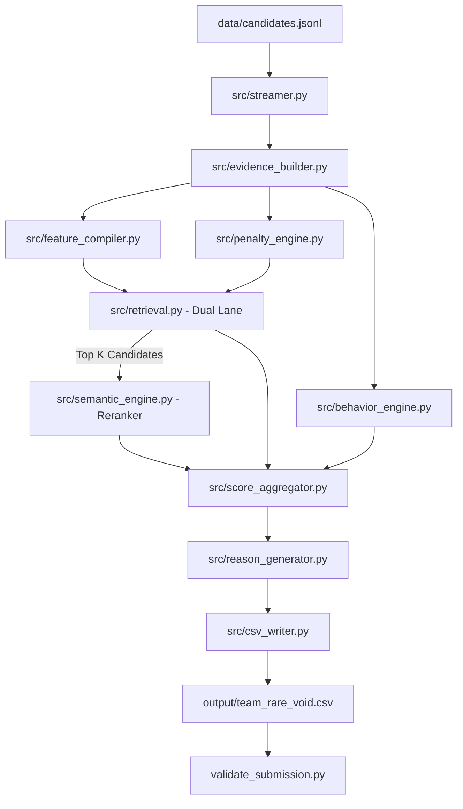

# RARE_VOID: 13-Phase Hybrid RAG/Search Ranking Pipeline

Welcome to the official repository for team **RARE_VOID**'s solution to the India Runs Data & AI Challenge. This repository contains a production-grade, highly optimized multi-stage candidate scoring and ranking pipeline designed to evaluate 100,000+ candidate profiles and identify the top 100 fits for senior AI/ML roles.

---

## 📖 Table of Contents
1. [Pipeline Architecture & Methodology](#-pipeline-architecture--methodology)
2. [Repository Structure](#-repository-structure)
3. [System Prerequisites](#-system-prerequisites)
4. [Step-by-Step Setup & Run Guide](#-step-by-step-setup--run-guide)
5. [Running Unit Tests](#-running-unit-tests)
6. [Methodology & Scoring Factors](#-methodology--scoring-factors)
7. [Troubleshooting & Common Errors](#-troubleshooting--common-errors)

---

## 🛠 Pipeline Architecture & Methodology

The **RARE_VOID** pipeline processes candidate profile data via a multi-stage funnel designed for speed, reproducibility, and precision. It combines deterministic heuristic indexing, vector-based technical feature compiling, behavior signal mapping, and offline semantic similarity embedding to select and explain the top 100 candidates.



### Key Highlights
* **Streaming Parser**: Processes candidates in a memory-efficient generator, handling large JSONL streams without loading all data into RAM.
* **Dual-Lane Retrieval**: Combines an "AI/ML Technical" lane and a "Production/Shipped Systems" lane to retrieve candidate subsets, protecting "hidden gems" who excel in engineering depth but lack generic keywords.
* **Offline Semantic Reranking**: Uses a local sentence-transformer model (`all-MiniLM-L6-v2`) to compute semantic alignment with the Job Description (JD).
* **Behavior Engine**: Aggregates 9 recruiter engagement and candidate activity signals using a fixed reference date to ensure deterministic reproducibility.
* **Deterministic Tie-Breaker**: Ensures consistent ranking using technical score, response rate, years of experience, GitHub score, and candidate ID ascending.
* **Diverse Reasoning Templates**: Employs structural template patterns matching rank tiers and candidate features to generate clean, explainable sentences.

---

## 📂 Repository Structure

Below are the main directories and components of this workspace:

| File / Folder Path | Description |
| :--- | :--- |
| **Orchestrating & Run Scripts** | |
| [reproduce.bat](reproduce.bat) | Windows batch script to run the entire pipeline end-to-end. |
| [reproduce.sh](reproduce.sh) | Linux/macOS shell script for end-to-end execution. |
| [requirements.txt](requirements.txt) | Python package requirements (NumPy and Sentence Transformers). |
| [setup_model.py](setup_model.py) | Python helper to download the Sentence Transformer model for offline use. |
| [validate_submission.py](validate_submission.py) | Challenge format validator ensuring structure, rank monotonicity, and ID rules are met. |
| [submission_metadata.yaml](submission_metadata.yaml) | Team info, contact, compute environment, and methodology metadata. |
| **Pipeline Source Code (`src/`)** | |
| [src/main.py](src/main.py) | Main orchestrator managing the workflow phases and inline output validation. |
| [src/config.py](src/config.py) | Global configuration settings, feature weights, boundaries, and static lookup sets. |
| [src/streamer.py](src/streamer.py) | Generator-based JSONL parser for low memory footprint. |
| [src/evidence_builder.py](src/evidence_builder.py) | Extracts raw texts, skill profiles, and redrob signals into a structured dictionary. |
| [src/jd_matrix.py](src/jd_matrix.py) | Defines the single source of truth for critical and strong keywords/skills in the JD. |
| [src/aliases.py](src/aliases.py) | Manages query expansion lists and pre-compiles regex patterns for matching. |
| [src/feature_compiler.py](src/feature_compiler.py) | Generates a 20-feature scoring matrix for mathematical processing. |
| [src/penalty_engine.py](src/penalty_engine.py) | Calculates and applies soft penalties and hard filters (e.g. consulting-only, pure research). |
| [src/retrieval.py](src/retrieval.py) | Performs dual-lane candidate retrieval and limits candidate lists before reranking. |
| [src/semantic_engine.py](src/semantic_engine.py) | Loads local sentence-transformers, structures payload text, and reranks candidates. |
| [src/behavior_engine.py](src/behavior_engine.py) | Normalizes response rate, activity date, notice period, and recruiter saves. |
| [src/score_aggregator.py](src/score_aggregator.py) | Combines technical and semantic scores, applies behavior multipliers, and resolves ties. |
| [src/reason_generator.py](src/reason_generator.py) | Formulates structured, natural language explanation summaries for selected candidates. |
| [src/csv_writer.py](src/csv_writer.py) | Exporters of ranked datasets into clean, standard CSV formats. |
| [src/profiling.py](src/profiling.py) | Captures executing runtime metrics across all phases. |
| **Analysis (`analysis/`) & Tests (`tests/`)** | |
| [tests/test_pipeline.py](tests/test_pipeline.py) | Test suite covering 66 unit tests for all mathematical bounds, algorithms, evidence extraction, retrieval, streaming, CSV writing, profiling, and integration. |
| [analysis/dataset_report.py](analysis/dataset_report.py) | Generates overview statistics of the candidates dataset (with CSV export). |
| [analysis/honeypot_finder.py](analysis/honeypot_finder.py) | Scans for anomalies such as timeline claims and skill-experience inflation (with CSV export). |
| [analysis/utils.py](analysis/utils.py) | Shared utilities for loading candidates and resolving data paths. |

---

## 💻 System Prerequisites

* **Python Version**: `Python 3.10` or `Python 3.11` (recommended).
* **System Specs**: At least 8GB RAM is recommended. The pipeline runs fine on standard CPU setups and completes within the challenge time limits.
* **Internet Connection**: Required only once during setup to download the Sentence Transformers model via `setup_model.py`. The `local_model/` folder should exist locally for the pipeline to run with semantic reranking.

---

## 🚀 Step-by-Step Setup & Run Guide

Follow these steps to run the pipeline on your machine:

### Step 1: Clone or Open the Directory
Ensure you are in the project's root folder:
```bash
cd redrob_rare-void
```

### Step 2: Create and Activate a Virtual Environment
We recommend using a clean virtual environment to prevent package version conflicts:

**On Windows (PowerShell/CMD)**:
```powershell
python -m venv venv
venv\Scripts\activate
```

**On Linux/macOS**:
```bash
python3 -m venv venv
source venv/bin/activate
```

### Step 3: Install Required Dependencies
Install the required scientific packages:
```bash
pip install -r requirements.txt
# Ensure pytest is installed for test coverage
pip install pytest
```

### Step 4: Download the Local Offline Model
Download and save the Sentence Transformers model locally in `./local_model`. This ensures subsequent pipeline steps run fully offline:
```bash
python setup_model.py
```
> [!NOTE]
> Verify that the directory `local_model/` has been created and populated with files including `model.safetensors` and `config.json`.

### Step 5: Place the Challenge Dataset
Ensure the candidate dataset file `candidates.jsonl` (or its `.gz` version) is placed under the `data` directory:
* Expected Path: `data/candidates.jsonl`

### Step 6: Run the Pipeline End-to-End
You can run the pipeline using the provided orchestrator commands or scripts.

#### Option A: Running with standard Python command
```bash
python -m src.main --candidates data/candidates.jsonl --out output/team_rare_void.csv
```

#### Option B: Running the automation scripts
* **On Windows**:
  ```cmd
  reproduce.bat
  ```
* **On Linux/macOS**:
  ```bash
  chmod +x reproduce.sh
  ./reproduce.sh
  ```

> [!TIP]
> The scripts will automatically create a virtual environment, install dependencies, run unit tests, run the end-to-end pipeline, and validate the output file. 

> [!IMPORTANT]
> **Offline Evaluation Sandbox Compliance**: The `reproduce.bat` and `reproduce.sh` scripts no longer call `setup_model.py`. This ensures they comply with the strict "no network" rule in the Stage 3 evaluator sandbox. **You must run `setup_model.py` yourself locally to download the model into `./local_model` before running the pipeline. The `reproduce` scripts will create a venv and install dependencies automatically.**
---

## 🧪 Running Unit Tests

The repository contains 66 unit tests covering config properties, normalization formulas, tie-breakers, behavior calculations, penalty capping, features, industry fit, recency, product-co ratios, reasoning deterministic structure, evidence extraction, dual-lane retrieval, streaming, CSV writing, profiling, enforce_monotonicity, aliases, and full integration.

Run the test suite using `pytest`:
```bash
python -m pytest tests/test_pipeline.py -v
```

All tests should pass without warnings or errors.

---

## 📊 Methodology & Scoring Factors

The final candidate rank score is calculated as follows:

$$\text{Technical Score} = (\text{Feature Vector} \cdot \text{Weights}) - \text{Penalties}$$

$$\text{Combined Tech Score} = (0.60 \times \text{Normalized Tech}) + (0.40 \times \text{Normalized Semantic})$$

$$\text{Final Score} = \text{Combined Tech Score} \times \text{Behavioral Multiplier}$$

### 1. Technical Features (F0–F19)
We compile 20 features mapped to weights summing to `1.0`:
* **Critical** (~50%): Vector Database depth, RAG pipeline building, Search system metrics evaluation (NDCG/MRR), and Python backend.
* **Strong** (~17%): Recommendation systems, Learning-to-Rank (LTR), and LLM fine-tuning.
* **Career & Logistics** (~33%): Production depth, non-consulting tenure ratios, location fits, education credentials, expected salary fit, and pre-LLM experience.

**Depth-Weighted Scoring (F0–F6)**: Features F0–F6 use duration-weighted depth scoring instead of simple keyword counting. Each skill is scored based on:
| Signal | Score Contribution | Example |
|:---|:---|:---|
| Skill with duration + career description mention | `0.5 + 0.5 × min(duration/36mo, 1.0)` | Faiss expert for 3 years who described building a Faiss system at work |
| Career description mention only | `0.35` | Mentioned "deployed semantic search" in work history, no matching skill entry |
| Skill with duration only | `0.25 × min(duration/36mo, 1.0)` | Listed Pinecone as a skill for 12 months, but never described using it |
| Keyword found with no duration or career context | `0.0` | Mentioned "faiss" once with 0 months duration |

### 2. Behavioral Multiplier
The behavior engine aggregates 9 recruiter engagement signals (response rate, GitHub activity, availability, demand, response time, recruiter saves, profile completeness, interview completion, applications) into a multiplier clamped to **[0.70, 1.15]** (~1.64:1 ratio). Strong behavioral signals can boost scores up to +15%, while weak signals can penalize up to -30%, making engagement a meaningful differentiator beyond a pure tiebreaker.

### 3. Semantic Reranking
The offline MiniLM reranker computes cosine similarity between candidate profiles and the JD. Scores are normalized using **10th/90th percentile anchoring** (with `np.clip` to [0, 1]) instead of min-max, preventing single outliers from compressing the entire score distribution.

### 4. Penalty Rules
* **Hard Filters (Drop immediately)**:
  * Consulting-only background with no production evidence (penalty $\ge 0.50$).
  * Academic-only research without production implementations (penalty $\ge 0.50$).
  * CV/Speech domains with no retrieval or ranking background (penalty $\ge 0.50$).
  * LangChain/wrapper developers with zero pre-2022 ML experience (penalty $\ge 0.50$).
* **Soft Penalties (Tiered Deductions)**:
  * Profile timeline claims mismatch (difference between claimed years and career history duration).
  * Skill inflation honeypots (claiming $\ge 3$ expert skills with 0 months duration).
  * Excessively long notice periods ($> 120$ days).

---

## 🔍 Troubleshooting & Common Errors

Here are solutions to typical issues you may encounter:

### 1. `ModuleNotFoundError: No module named 'sentence_transformers'` or `'numpy'`
* **Cause**: Your Python shell is running in your global environment rather than the activated virtual environment, or packages didn't install.
* **Solution**: Re-run the virtual environment activation step and reinstall:
  ```bash
  # Windows
  venv\Scripts\activate
  pip install -r requirements.txt
  ```

### 2. `WARNING: ./local_model not found! Semantic scores will be 0.`
* **Cause**: The model download script wasn't run, or it was interrupted.
* **Solution**: Ensure your internet connection is active and run the download script:
  ```bash
  python setup_model.py
  ```
  Double-check that the folder `./local_model` exists at the root of the workspace.

### 3. Windows Encoding / Console Crashes (`UnicodeEncodeError` / `cp1252` crash)
* **Cause**: Windows terminals default to code page `cp1252` which crashes when writing or outputting UTF-8 encoded characters.
* **Solution**: Force UTF-8 environment variables before starting Python:
  ```cmd
  set PYTHONIOENCODING=utf-8
  chcp 65001
  python -m src.main
  ```
  *(Note: The [reproduce.bat](reproduce.bat) file implements this automatically).*

### 4. `FileNotFoundError: [Errno 2] No such file or directory: 'data/candidates.jsonl'`
* **Cause**: The input dataset is missing or named differently.
* **Solution**: Confirm that your dataset is placed inside the `data` directory and is named `candidates.jsonl`. If your dataset is compressed (e.g., `candidates.jsonl.gz`), you can pass that name to the program directly:
  ```bash
  python -m src.main --candidates data/candidates.jsonl.gz --out output/team_rare_void.csv
  ```

### 5. `Validation failed (x issue(s)): score must be non-increasing by rank`
* **Cause**: Monotonicity violation in the output CSV. Ranks and scores must decrease together.
* **Solution**: The pipeline uses an internal helper `_enforce_monotonicity` in [src/main.py](src/main.py#L20-L26) before output writing. If you modified `_enforce_monotonicity` or bypass the aggregator, make sure scores are strictly sorted in descending order (with tie-breakers resolving matching scores).

### 6. Out of Memory (OOM) Errors / Slow Processing
* **Cause**: Other pipelines load the entire JSON file into lists. RARE_VOID streams it via a generator to handle low-spec machines.
* **Solution**: If running on low memory specs (e.g. < 8GB RAM), close background apps. You can run the pipeline with specific components disabled for testing purposes:
  ```bash
  # Run without the Sentence Transformer reranker step
  python -m src.main --ablation semantic_off
  ```
